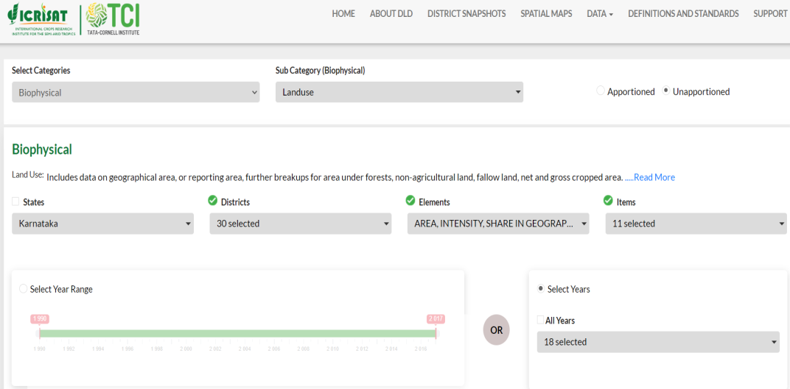
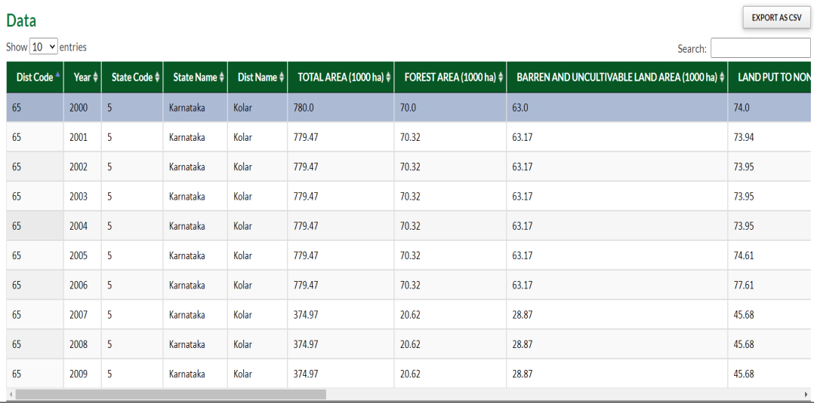
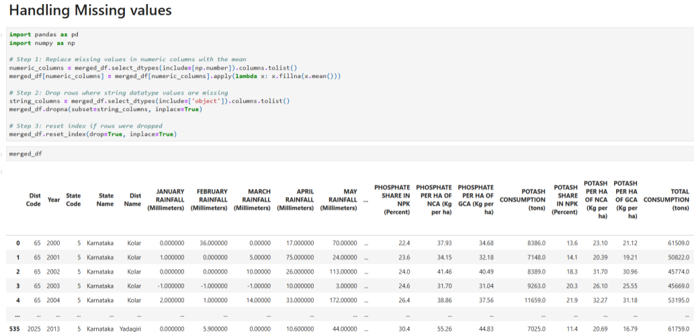
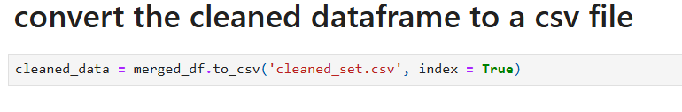
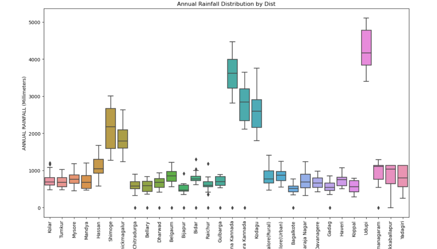
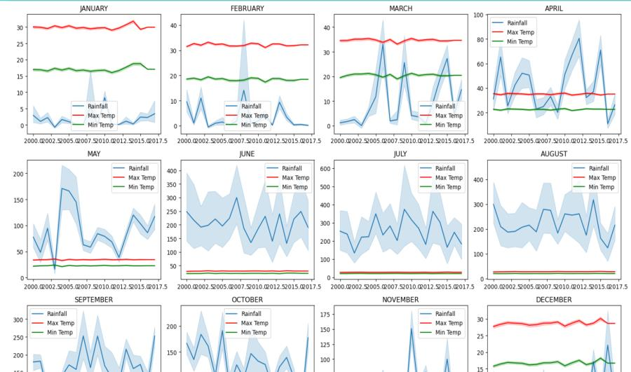
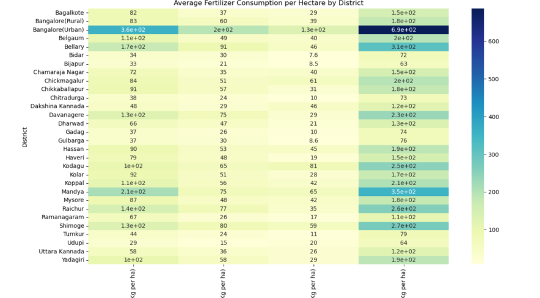
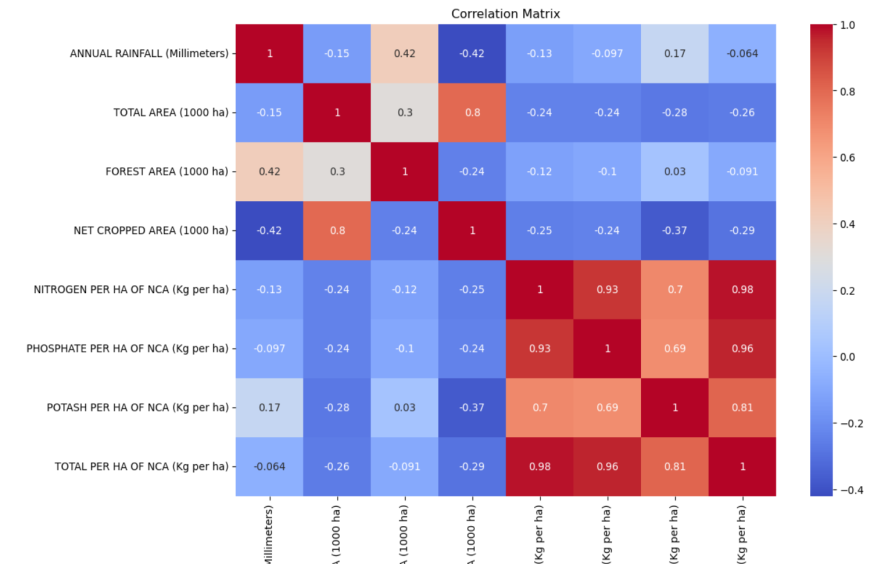

# Data Driven Insights into Soil Fertility and Sustainability

## Objectives 
*  Identify Key Factors Influencing Soil Fertility and Crop Productivity
* Develop a Data-Driven System for Informed Decision-Making
* Assess the Current State of Soil Health Across Karnataka
* Provide Recommendations for Sustainable Agricultural Practices
* Promote Long-Term Sustainability and Environmental Health

## Methodology
1. Data Collection:
* Monthly rainfall: Data on the amount of rainfall received each month, crucial for understanding water availability and its effects on soil moisture and crop growth.
* Temperature (Maximum and Minimum): Temperature data helps in assessing the thermal conditions affecting soil processes and plant growth.
* Water Deficit: Information on water shortage, which can impact soil moisture levels and crop health.
* Land-use patterns: Data on how land is utilized, including agricultural, residential, and industrial uses, which can influence soil quality.
* Fertilizer consumption: Information on the types and quantities of fertilizers used, essential for evaluating nutrient availability in the soil.

2. Data Merging:
Once the datasets were collected, they were loaded into DataFrames using the pandas library. Common columns were identified for merging, and the datasets were integrated using the ‘merge’ function. This step ensured that all relevant data points were consolidated into a single comprehensive dataset.

3. Handling Missing Values:
Missing values in the datasets were identified and handled by replacing them with mean values. This step ensured that the dataset was complete and ready for analysis without losing significant information.

4. Data Conversion:
The cleaned and merged DataFrame was then converted into a CSV file. This conversion facilitated easier handling and manipulation of data for further analysis and visualization.

5. Data Visualization:
Various visualization techniques were employed to explore and understand the dataset. These 
techniques included:
* Boxplots: To visualize the distribution and identify outliers in the data.

* Line plots: To observe trends and patterns over time.

* Heatmaps: To analyze correlations between different variables.

* Correlation matrices: To examine the relationships between various factors affecting soil health.

## Results / Findings
The analysis of the datasets yielded several significant insights into the factors affecting soil health in Karnataka:
* Seasonal Variations: Seasonal variations in rainfall and temperature were identified, which have a direct impact on soil health and crop productivity. For instance monsoon seasons showed higher soil moisture levels due to increased rainfall, while dry seasons exhibited water deficit issues.
* Correlations between Variables: Strong correlations between land use, fertilizer consumption, and soil health parameters were established. For example, excessive fertilizer use was found to correlate with certain soil nutrient imbalances.
* Trends and Patterns: Trends and patterns over time were identified, providing insights into long-term changes in soil health. This information is valuable for predicting future soil conditions and planning sustainable agricultural practices.

## Conclusion
This project has successfully provided data-driven insights into soil fertility and sustainability in Karnataka. By analyzing various factors such as rainfall, temperature, land use, and fertilizer consumption, the study has uncovered important trends and patterns that affect soil health. The findings offer valuable information for developing sustainable agricultural practices and making informed decisions regarding soil management and crop selection.

## Future Work
To further enhance the accuracy and comprehensiveness of the analysis, future work could focus on:
* Incorporating more data sources: Including additional data sources such as soil composition and crop yield data can provide a more detailed understanding of soil health and crop productivity.
* Utilizing machine learning models: Implementing machine learning models can help predict soil health and crop productivity more accurately, assisting farmers in making better-informed decisions.
By continuing to expand and refine the analysis, this project can contribute significantly to promoting sustainable agriculture in Karnataka and beyond.

## References
* ICRISAT. (n.d.). District Level Database for Indian Agriculture. Retrieved from http://data.icrisat.org/dld/